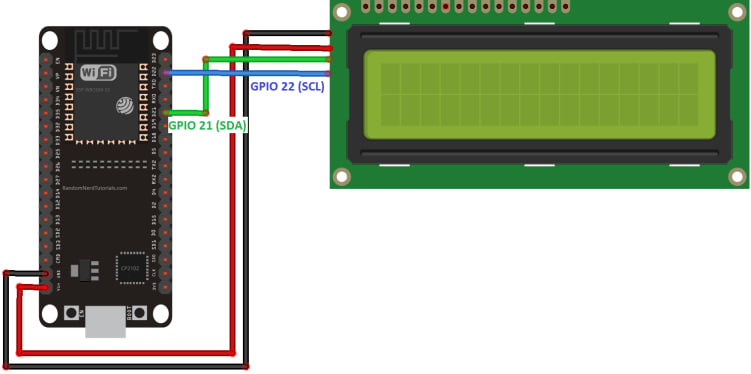
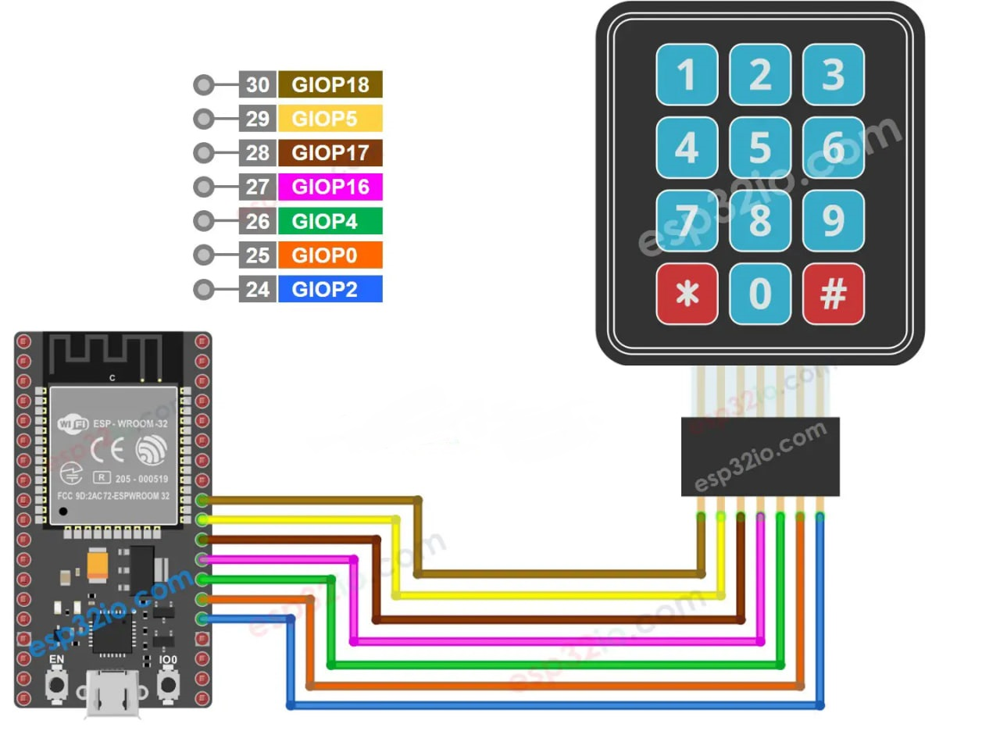

# calculator
a Simple Arduino Calculator 

#Wiring LCD1602I2C to esp32

ESP32       LCD1602I2C
GND ------> GND
VIN(5V) ------> VCC
GPIO21 (D21) ------> SDA
GPIO22 (D22) ------> SCL

#Wiring Keypad M3X4 to esp32

